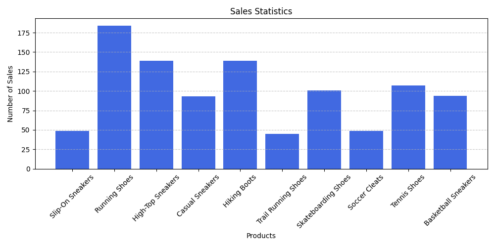

# ProductSalesTracker

A Python utility to track, analyze, and visualize product sales data.

This script reads raw product sales from a text file, generates a structured CSV file with detailed sales records, and creates a bar chart summarizing the number of sales per product. It demonstrates Python skills in file I/O, data processing, and visualization.

## Project Overview
**ProductSalesTracker** was created to simulate basic sales tracking in a retail environment. It reads a text file (`product_sales.txt`) containing product IDs for each sale, counts the number of sales per product, writes detailed records to a CSV file, and plots a bar chart showing total sales per product.

Key features:

- Parsing raw sales data from text files
- Mapping product IDs to names and prices
- Generating structured CSV reports with date and sale ID
- Creating visual summaries using a bar chart
- Handling data efficiently with Python’s `collections.Counter`
## Repository Contents
```
| File | Description |
|------|-------------|
| `sales_tracker.py` | Main Python script that reads sales data, generates CSV output, and plots a bar chart |
| `product_sales.txt` | Sample input file containing product IDs of sales |
| `product_sales.csv` | CSV output file generated by the script (created after running) |
| `example_image.png` | Example of the generated sales bar chart |
| `.gitignore` | Git ignore file |
| `README.md` | Project documentation |
```

## Features

- Reads product sales data from a `.txt` file
- Maps product IDs to names and prices
- Counts total sales per product
- Exports detailed sales records to a CSV file
- Generates a bar chart visualization
- Includes current date and unique sale IDs in export

## Tech Stack

- **Python 3.x**
- **Matplotlib** (for plotting)
- **collections.Counter** (for counting sales)
- Standard library modules: `csv`, `datetime`

## Requirements

Install dependencies:

```bash
pip install matplotlib
```

## How to run
1. Clone this repository
```bash
git clone https://github.com/VeselinMar/ProductSalesTracker.git
cd ProductSalesTracker
```
2. Make sure you have Python 3.x and matplotlib installed
3. Run the sales tracker script
4. The script will:
- Read product_sales.txt
- Count sales for each product
- Generate product_sales.csv containing:
Current Date Sale ID Product Name Product ID and Product Price
- Display a bar chart showing number of sales per product

```bash
python sales_tracker.py
```

# Example output

 

## Learning Outcomes
- Through this project I practiced:
- Reading and parsing text files in Python
- Using Counter to aggregate data
- Mapping IDs to descriptive data
- Exporting data to CSV
- Visualizing results using Matplotlib
- Automating repetitive tasks

## Author

**Veselin Marinov**  
Python Developer  
GitHub: https://github.com/VeselinMar 